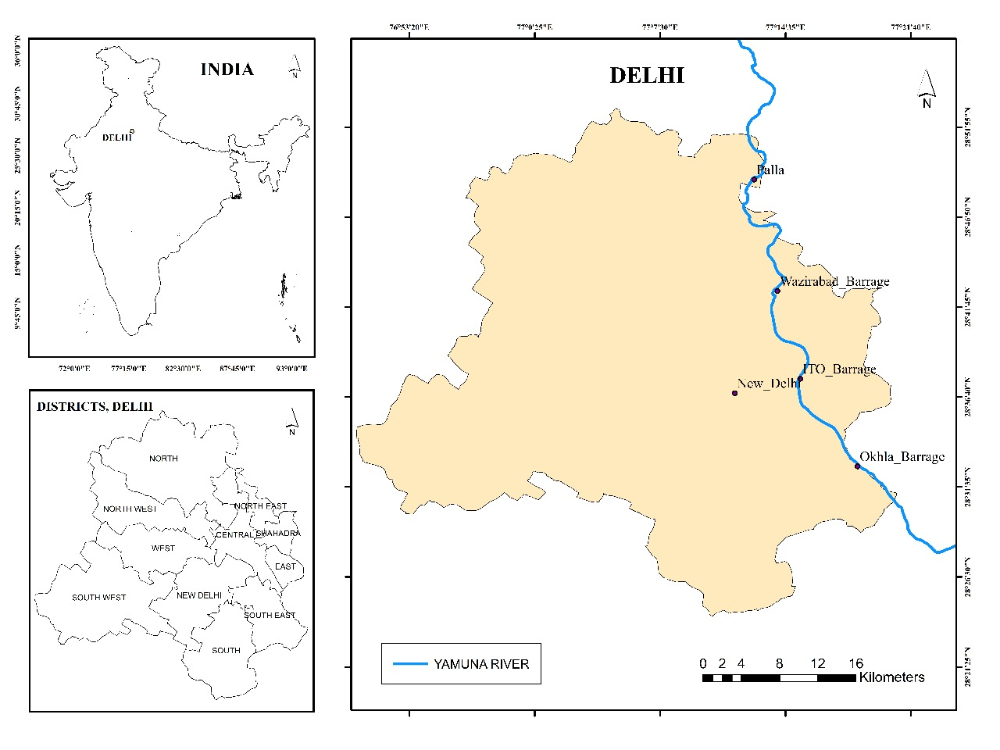
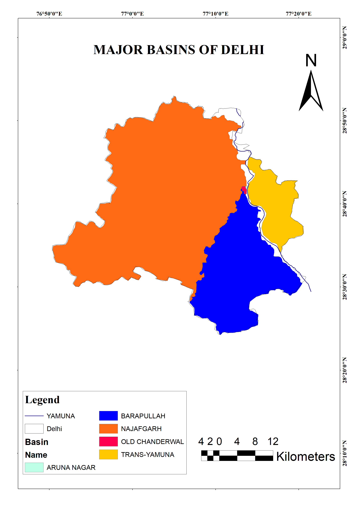
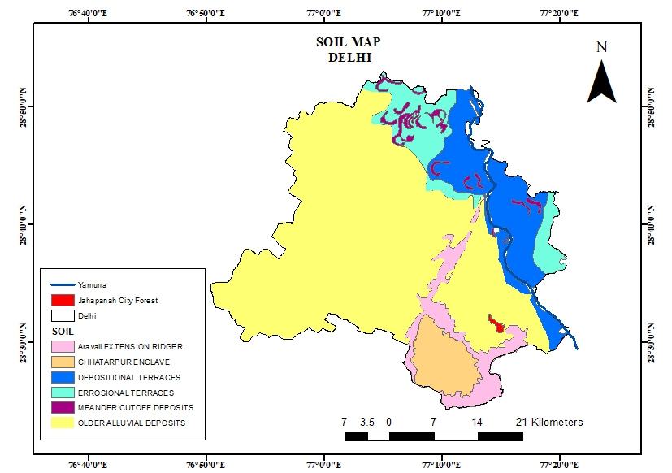
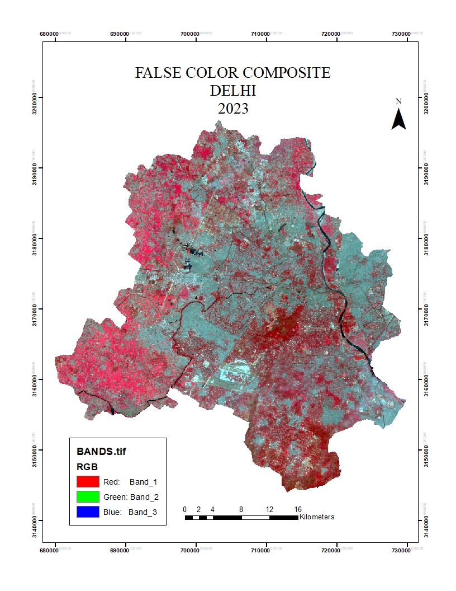

# -Flood-Peak-Estimation-of-Delhi-NCT

## Study Area

Delhi National Capital Territory (NCT), India

## Overview

This project focuses on hydrological analysis and flood peak estimation of various sub basins in Delhi using GIS and remote sensing techniques.

## Objectives

Delineate watershed and sub-basins
Analyze drainage patterns
Estimate peak discharge for the sub basins

Sub-basins analyzed:
- Aruna Nagar
- Old Chanderwal
- Trans Yamuna
- Barapullah Basin
- Najafgarh Basin

## Tools & Technologies

QGIS/ArcGIS
Python
Remote Sensing (SRTM DEM)
GIS Hydrology Tools

## Methodology

1. Data Collection
2. DEM preprocessing
3. Hydrological processing (i.e. Watershed Delineation, Sub Basin extraction etc.)
4. Calculation of peak discharge for various sub basins
5. Map preparation

## Output Maps

### Study Area Map

Study area representing Delhi NCT boundary.

### Land Use and Land Cover Map

Land use and land cover pattern of Delhi.

### Sub-Basin Map

Detailed sub-basin classification for hydrological analysis.

### Soil Map

Soil distribution affecting infiltration and runoff.

---

### False Color Composite (2023)

Remote sensing image highlighting vegetation and land cover.

## Results
Estimated PMF values:

| Basin | PMF (m³/s) |
|------|------|
| Trans Yamuna | 761.81 |
| Barapullah | 1996.74 |
| Najafgarh | 4570.38 |

## Project Report
Full report available here:

[Flood Peak Estimation Report](Flood_Peak_Estimation_Delhi_NCT.pdf)

## License
MIT License

## Authors
Suranjan & Sanchita
